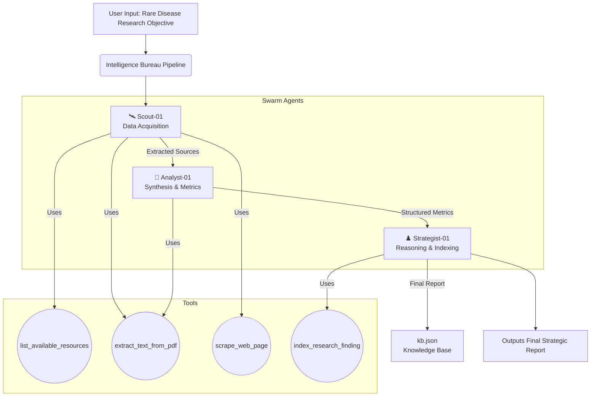

# Intelligence Bureau: Strategic Research Swarm

This project is a multi-agent AI system built using the **google-adk** framework and **Gemini 2.0 Flash**. It is designed to gather, synthesize, and reason over unstructured medical data—specifically tailored to scout, analyze, and compile research on clinical trials and rare diseases.

## Project Description
In our latest update, we successfully migrated the Intelligence Bureau from a monolithic agent into a refined folder structure following modular GitHub best practices (`/agents`, `/tools`, `/app`). The Swarm utilizes an in-memory session service to sequentially and autonomously scour local PDFs and web URLs, scrape clinical data metrics, and synthesize comprehensive strategic medical reports. 

## 🏗️ Functional Diagram (NotebookLM Generated)



## Swarm Architecture (Multi-Agent)
The Bureau operates as a coordinated swarm of specialized phases handled by the `research_swarm` agent:
- 🛰️ **Scouting Phase**: Uses `list_available_resources` to discover local PDFs in the `resources/` folder, plus `scrape_web_page` and `extract_text_from_pdf` to gather raw intelligence evidence.
- 🔬 **Analysis Phase**: Processes raw data to identify patterns, facts, and hidden insights.
- ♟️ **Strategy Phase**: Formulates high-level strategy reports and indexes findings using `index_research_finding`.

## 📁 Local Resources
You can drop research PDFs into the `resources/` directory. The Swarm will automatically check this folder first to "find" internal research documents before looking elsewhere.

## Setup
1. Clone this repository.
2. Install dependencies:
   ```bash
   pip install -r requirements.txt
   ```
3. Create a `.env` file and add your Google Gemini API Key:
   ```env
   GOOGLE_API_KEY=your_key_here
   ```

## Usage
Run the main script from the root directory:
```bash
python app/main.py
```

### Example Queries
- "Analyze this medical paper for rare disease breakthroughs: [PDF URL]"
- "Research the current state of Solid State Battery technology and synthesize recent trial results from web articles."
- "Compare the efficacy of mRNA vs Viral Vector vaccines based on publicly available trial PDFs."

## Swarm Architecture
The system uses **Gemini 2.0 Flash** for fast, high-context reasoning. The `IntelligenceBureau` class acts as the coordinator, managing a session via `google-adk` with automatic function calling enabled, allowing the model to interact with the physical world (web/files) as needed.
